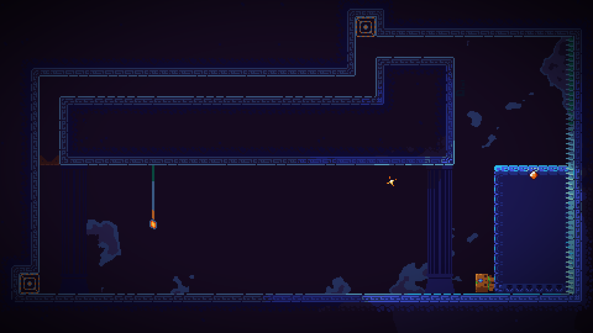

# Mask of the tomb (temporary title)

This is a small, sokoban-style puzzle platformer I've been sporadiucally working on over the past year. It is written in Go using ebitengine, and uses LDtk for level editing. I also (plan to) make music for the game using Supercollider. The project can be run by downloading the repo and using 

```
  go run .
```

but there will most likely be lots of bugs, and the player experience will not be great. At some point I will make a demo/alpha release, then I will also add it here. 

I have also made a small package that integrates LDtk with ebitengine (https://github.com/angrycompany16/ebiten-LDTK), so check that out if you're interested. The game also has an [itch.io page](https://angrycompany16.itch.io/mask-of-the-tomb), so maybe check that out as well, I will eventually be uploading web builds there.

# Screenshots

coming soon

<!--
Source - https://stackoverflow.com/a/65948716
Posted by fisch2, modified by community. See post 'Timeline' for change history
Retrieved 2026-02-22, License - CC BY-SA 4.0
-->

<p align="center">
  
&nbsp; &nbsp; &nbsp; &nbsp;
  
</p>


| | |
|-|-|
|||
|||


